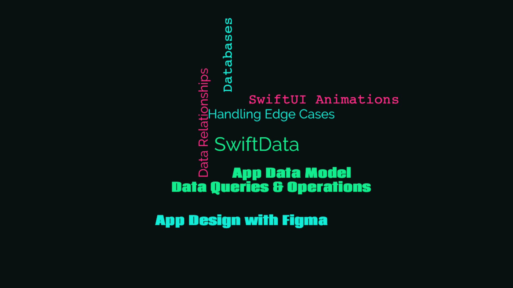

    
    
    
    

## About the app

### Chckpnt

A project tracker app for your project updates and focus. Break down your objectives however small or big you'd like. Go as small as atomic if it helps you build consistency to work on your projects.

To record your project progress, you can either log your project updates or complete any focus that you've set. 

Go as detailed as you'd like by defining a headline and summary for your project updates, with a number of hours you've worked on a particular update.

Set your current focus to stay on topic while working on a particular feature, UI, bug, etc. and complete them as a milestone.

All updates logged and milestones achieved are auto-recorded with a datestamp and into sessions. A session is equivalent to a day and therefore can contain multiple project updates and milestones achieved.

 ##### *Built in [Swift](https://developer.apple.com/swift/) & [SwiftUI](https://developer.apple.com/xcode/swiftui/), featuring the [SwiftData](https://developer.apple.com/documentation/swiftdata) framework for local data persistence and a MV (Model-View) architectural design pattern.*

    

## Concepts learned

    

## Credits

##### Swift, SwiftUI, SwiftData, Xcode, SF Symbols, Cocoa Touch, Safari, App Store, iPhone & iOS, iPad & iPadOS, Apple Watch & watchOS, Apple TV & tvOS, Mac & macOS and their logos are trademarks of Apple Inc., registered in the U.S. and other countries.

